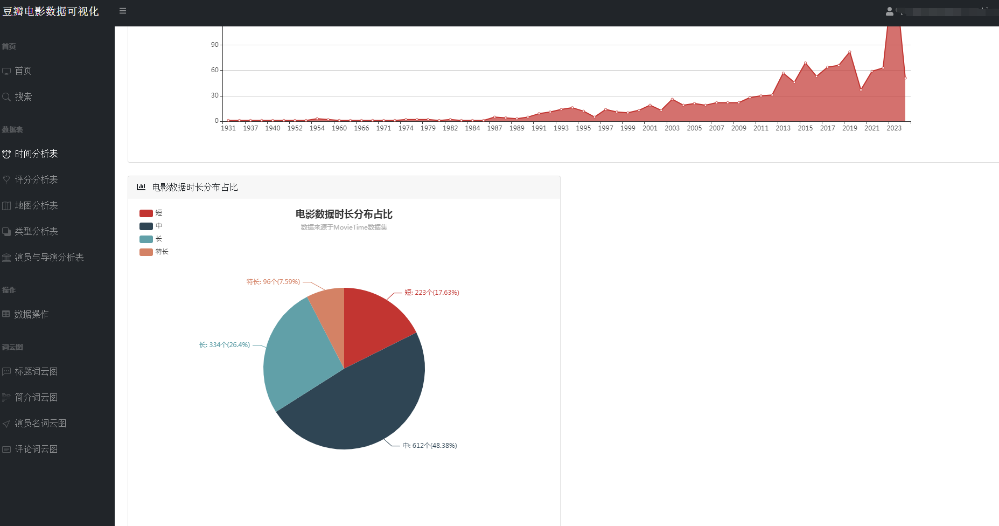

## 计算机毕业设计Python电影评论情感分析 电影可视化 豆瓣电影爬虫 电影推荐系统 电影数据分析 电影大数据 大数据毕业设计 机器学习 深度学习 知识图谱 人工智能 Hadoop Spark

## 要求
### 源码有偿！一套(论文 PPT 源码+sql脚本+教程)

### 
### 加好友前帮忙start一下，并备注github有偿纯python电影可视化
### 我的QQ号是2827724252或者798059319或者 1679232425或者微信:bysj2023nb 或bysj1688

# 

### 加qq好友说明（被部分 网友整得心力交瘁）：
    1.加好友务必按照格式备注
    2.避免浪费各自的时间！
    3.当“客服”不容易，repo 主是体面人，不爆粗，性格好，文明人。
	
### 论文
一、项目简介
在大数据与人工智能技术蓬勃发展的背景下，我们精心打造了一款基于Python的豆瓣电影数据分析与可视化系统，致力于为电影爱好者与专业人士提供全方位、个性化的观影服务体验。现今，人们对电影欣赏的需求已超越单一的娱乐诉求，转而追求个性化推荐、深度解读及社区互动的综合体验。
该系统构筑了涵盖数据采集、数据概览、电影检索、数据管理、词云分析及多维可视化六大支柱的立体服务矩阵。首先，系统从豆瓣电影平台抓取包括影片详情、评分、评论、标签等在内的丰富信息，确保数据获取的针对性与合规性。
系统对所采集的电影数据进行整合与梳理，生成简洁明了的数据概览报告，概述整体数据集的特征，如平均评分、热门类型、高分导演与演员等关键指标。同时，用户可利用强大且灵活的查询功能，依据影片名称、关键词、导演、演员、类型、上映年份等多维度条件，快速定位感兴趣的内容。
平台提供电影数据的精细化管理功能，用户可对已获取的数据进行编辑操作，便于个性化整理与长期跟踪。此外，系统引入词云图这一可视化工具，生动呈现电影标题、演员、评分、简介等文本数据中的高频词汇与主题热点，直观揭示观众关注焦点与市场趋势。
系统集成了一系列深度可视化的组件，对电影数据进行全方位、多层次的解析与展示如时间序列分析、地理分析、类型分析、导演与演员分析等
通过整合Python的Flask框架、MySQL数据库以及NumPy、Pandas、Matplotlib等数据分析与可视化库，我们的豆瓣电影数据分析与可视化系统不仅具备强大的数据处理与分析能力，还能够为用户提供流畅、直观且富有洞察力的交互体验，让电影爱好者与专业人士在轻松的浏览过程中，深度感知电影市场的脉动与趋势。
综上所述，基于Python的豆瓣电影数据分析与可视化系统，凭借数据采集、数据概览、电影查询、数据管理、词云图展示以多维度可视化分析，构建了一个满足用户个性化需求、促进深度参与的电影数据探索平台。无论是资深影迷还是偶尔观影的大众用户，都能在这个系统中发掘电影世界的新视角，深化对电影艺术与市场的认知。

二、开发环境
开发环境	版本/工具
PYTHON	3.6.8
开发工具	PyCharm
操作系统	Windows 10
内存要求	8GB 以上
浏览器	Firefox (推荐)、Google Chrome (推荐)、Edge
数据库	MySQL 8.0 (推荐)
数据库工具	Navicat Premium 15 (推荐)
项目框架	FLASK
三、项目技术
后端：Flask、PyMySQL、MySQL、urllib
前端：Jinja2、Jquery、Ajax、layui

四、功能结构
数据采集：利用Python编程技术对抓取豆瓣电影数据，包括影片基本信息（如标题、年份、类型）、主创团队、评分、评论、简介等多元信息。
数据概览：收集的电影数据经过清洗、整合后，平台自动生成详尽的数据概览报告，包括但不限于最高评分、评分折线图、最受欢迎类型、电影种类数、热门演员等统计摘要。这些概览有助于用户快速理解数据集的整体特征与市场趋势。
信息检索：平台提供用户友好的搜索接口，支持用户根据影片名称、关键词条件进行精确或模糊查询，迅速定位目标电影及相关信息，满足个性化研究与兴趣探索需求。
数据管理：对已获取的电影数据进行删除功能，以及对电影的图片、主演等属性的管理。
词云分析：平台运用词云图技术，动态展示电影标题、演员、评分、简介等文本数据中的高频词汇，直观呈现热门话题、明星影响力、观众情感倾向等文本特征。
数据可视化：平台搭载丰富多样的可视化图表，对电影数据进行深度解析。
时间分析：通过折线图展示历年电影产量统计随年份的变化趋势；通过饼状图展示电影数据时长分布占比。
评分分析：通过选择不同的类型，展示该类型电影评分统计；豆瓣年度评价评分柱状图；豆瓣电影中外评分分布图；不同的电影豆瓣评分星级饼状图
地图分析：通过柱状图展示电影拍摄地点统计，通过饼状图展示电影语言统计
类型分析：通过饼图展示各电影类型在总数据中的占比。
导演与演员分析：通过柱状图展示导演作品数量前20，通过折线图展示演员参演排名前20

### 本项目的实现流程主要是四个方面：
第一方面：数据获取。通过访问豆瓣电影详情页 URL 获取响应信息，通过 Python 中的解 析库对得到的响应信息进行解析。其次通过对正则表达式的使用，对所需信息的定位从 response 中获取想要的电影数据；
第二方面：数据存储。当我们通过编写爬虫代码从网页中爬取出我们所需要的数据后，需要将数据储存在本地数据库中，数据库可以高效、有组织地存储数据，使我们能够更快、更方便地管理数据，也为后续的数据预处理做准备；
第三方面：数据预处理。数据清洗是指当我们通过爬虫获取数据以后对数据进行清洗，通过python对于数据中的空值、异常值、无效值进行修改删除。进而对清洗后的数据进行分析处理。数据分析是指用适当的统计方法对收集来的大量第一手资料和第二手资料进行分析，以求最大化地开发数据资料的功能，发挥数据的作用。是为了提取有用信息和形成结论而对数据加以详细研究和概括总结的过程；
第四方面：数据可视化。前面我们所做的准备最终都是服务于可视化。数据可视化的意义是帮助人更好的分析数据，数据可视化的目的是让用户更好的使用数据。从词云图的分析将技术与艺术的结合，借助对词云数据的分类，清析的赋予信息实时性，赋予信息价值性，增加数据的可用性，三者相辅相成。即能促使数据可视化图表散发活力，也能从视觉上达到更加抢眼的效果，让用户能立即抓取关键信息。
	

### 演示视频
https://www.bilibili.com/video/BV1fb421J7mH/?spm_id_from=333.999.0.0

### 运行截图

### 附：论文
目  录
摘  要	1
ABSTRACT	2
第1章 绪论	3
1.1 研究背景	3
1.2 研究意义	3
1.3 研究目标	3
第2章 相关技术介绍	4
2.1 爬虫技术	4
2.2 pandas技术	4
2.3 Echarts技术	4
2.4 MySQL介绍	5
2.5 HTML介绍	5
2.6 CSS介绍	5
2.7 JavaScript介绍	5
2.8 Xpath介绍	5
2.9 Re介绍	6
第3章 系统需求分析	6
3.1 项目的必要性	6
3.2 技术可行性	6
3.3 时间可行性	7
3.4 经济可行性	7
第4章 豆瓣电影系统总体设计	7
4.1 环境及库的准备	7
4.2 数据库设计	9
4.3 项目流程	10
第5章 系统详细设计与实现	12
5.1 数据爬取	12
5.2 数据清洗、分析	15
5.3 数据存储	15
5.4 数据可视化	15
5.5 项目首页实现	16
5.6 项目可视化展示	17
5.6.1电影种类饼图	17
5.6.2电影评分折线图	18
5.6.3历年产量折线图	18
5.6.4电影数据时长分布占比	19
5.6.5电影评分折线图	19
5.6.6电影拍摄地点柱状图	20
5.6.7电影类型饼图	20
5.6.8导演作品数量柱状图	21
5.6.9演员参演排名折线图	21
5.6.10评论词云图	22
第6章 结论	23
6.1  设计总结	23
6.2 问题与展望	24
致  谢	25

 摘  要
随着如今电影越来越多，各种各样的烂片和捞钱的商业片也层出不穷，而有意义的电影慢慢的变得很少。本项目是基于对豆瓣网的子网站豆瓣电影的网络爬虫技术到数据可视化分析的实现，从Pycharm的环境搭建到数据爬取，再数据处理，最后数据的可视化。该项目通过爬虫爬取目标网站，获取数据，在数据可视化的过程中，使用ECharts对做出的图表进行可视化处理，可以提高用户在需要时查找所需要信息的识别率，通过图表让人一目了然，比如一些多角度动态视图，解决了用户首次了解解决率如何，从而显著提高用户对电影的满意程度。
关键词：Python；数据分析；爬虫；可视化

ABSTRACT
As there are more and more movies nowadays, various types of bad movies and commercial films that seek to make money are also emerging in an endless stream, while meaningful movies gradually become rare. This project is based on the implementation of web crawler technology to data visualization analysis of Douban Movie, a sub website of Douban. com, from the construction of Pycharm's environment to data crawling, data processing, and finally data visualization. This project crawls the target website through a crawler to obtain data. During the data visualization process, ECharts is used to visualize the charts made, which can improve the recognition rate of users when they need to find the information they need. Through charts, for example, some multi-angle dynamic views, it solves the problem of users' first understanding of the resolution rate, thereby significantly improving users' satisfaction with the movie.
Key words: movie; Python; data analysis; crawler; visualization

第1章 绪论
1.1 研究背景
步入21世纪以来，随着全球互联网的飞速发展，中国紧跟潮流，正在空前地迈向一个信息时代。作为全球第二的经济强国，人口高达14亿，每天产生的数据是一个令人恐怖的数据值。据中国互联网络信息中心公布的《中国互联网络发展状况统计报告》显示，中国上网用户人数达五千八百万人，手机上网用户数规模已高达12.9亿户。人们的娱乐生活也越来越丰富。看电影，也逐渐成为人们工作之余放松、休闲的重要娱乐活动。不同的人喜欢不同的的电影类型、喜欢不同导演的作品，但是大部分的人喜欢什么题材类型的电影，对于电影行业今后的发展有着重要的参考意义。 随着生活水平的提高，所以现在看电影成为人们越来越普遍的娱乐活动，平时没事的时候，人们经常会约上三五知己去电影院里看上一场酣畅淋漓的电影缓解一下身体的压力。那么对于电影这个行业，大数据时代的来临，它会面临什么样的冲击呢？ 

1.2 研究意义
基于python豆瓣电影数据可视化分析，通过该系统的数据分析就能够是豆瓣电影平台实现内容个性化推荐精确的内容分发, 比如我们在音乐app 上看到的每日推荐, 网易云之所以推荐这么准, 就是他们在做点击率预估模型(预测给你推荐的歌曲你会不会点击)的时候, 考虑了你的用户可视化画像属性。

1.3 研究目标
本课题的实现，需要利用python网络爬虫技术，需要python及其第三方库和其他工具，按照数据采集、数据预处理、数据分析、数据可视化流程来进行实现，让学生具备以整体大局观来看待事务，提升自己的交流合作能力，表达能力和综合技能。

第2章 相关技术介绍
豆瓣电影数据采集与可视化分析系统是用当前应用很广泛的Python语言和Flask框架，并结合CSS与HTML搭建Web网页，使用MySQL数据库对数据进行存储，依次来开发实现系统的功能。本系统运行需要的软件有Pycharm、普通浏览器、Navicat for MySQL等。
2.1 爬虫技术
Request是代表HTTP请求的对象 在服务器接收到客户daunt发送的请求后，调用service方法处理请求之前，服务器会创建出代表请求的request对象（用于封装请求信息），再将request对象（和response对象）传递给service方法，调用service方法来处理请求。
2.2 pandas技术
Pandas是python的一个数据分析包，最初由AQR Capital Management于2008年4月开发，并于2009年底开源出来，目前由专注于Python数据包开发的PyData开发team继续开发和维护，属于PyData项目的一部分。Pandas最初被作为金融数据分析工具而开发出来，因此，pandas为时间序列分析提供了很好的支持。 Pandas的名称来自于面板数据（panel data）和python数据分析（data analysis）。panel data是经济学中关于多维数据集的一个术语，在Pandas中也提供了panel的数据类型。
2.3 Echarts技术
Echarts 数据可视化框架通过Pandas数据分析框架我们从Mysql数据库拉到终端的数据集以及数据本体就不需要我们再对其进行处理。只需要交给Echarts可视化库即可。该库兼容当前大部分浏览器，（Chorme,Firefox,Safari等）能给用户提供直观，交互丰富，可高的个性化设置。提供了常见的统计表，我们需要做的就是封装好需要的数据类型以及数据格式传入到指定的实例化中即可。
2.4 MySQL介绍 
MySQL作为一种源码比较开源的 RDBMS，采用了目前最常见的数据库管理语言——结构式询问语言（SQL）来实现数据的处理。由于它的速度，可靠性和适应性， MySQL得到了广泛的重视。许多人都觉得 MySQL是不要求进行事务的最好的方法。
2.5 HTML介绍 
HTML是一种带有超文字标签的文字，是一种以超连接的形式来表达和整理用户需要的资讯的一种手段。它们可以在相同的文字中同时存在，也可以在其它的文档中存在，也可以在不同的电脑中存在。它把分散在各个地点的资料以一种任意的形式联系起来，便于用户寻找资料。
2.6 CSS介绍
分层风格表（英文全名：分层风格表）是一种用于表示诸如 HTML （一般标签语言的一种）、 XML （一般标签语言的一种）之类的文档风格的一种电脑语言。CSS不但能对页面进行静态的装饰，而且能与多种文字文字结合，对页面中的各个要素进行动态的格式设置。CSS可以在像素级别上准确地控制页面中的要素的放置，可以提供各种字体的大小，还可以实现页面的目标和模式的修改。
2.7 JavaScript介绍
JavaScript(Java脚本)是一种基于对象（Object）和事件驱动（ Event Driven）并具有安全性能的脚本语言，使用JavaScript可以轻松的实现与HTML的互操作，并且完成丰富的页面交互效果，它是通过嵌入或调入在标准的HTML语言中实现的，它的出现弥补了HTML的缺陷，是java与HTML折衷的选择。
2.8 Xpath介绍 
Xpath，全称XML Path Language,即XML路径语言，可以在XML，HTML文档中查找信息的语言,XPath的选择功能十分强大，提供了非常简明了的路径选择表达式。有超过100个内建函数和几乎所有的定位节点都可以用来选择。使用前需要进行导入Lxml，通过etree格式化网页内容，最后进行发送网页请求、网页解析。  
2.9 Re介绍  
re模块就是正则表达式的应用 正则表达式对字符串的逻辑操作，主要是对字符串的一种过滤，用“元字符” 与“普通字符”组成一个字符串规则对已知的字符串或文本过滤出自己想要的字符串，本身是对事先定义好的特殊字符以及特定的字符串进行组合拼接。主要的使用范围是对字符串进行获取特定的部分，使用前需导入Re模块，其内置函数有：sub、search、match等通过与Xpath获取的数据进行配合使用。 

第3章 系统需求分析
3.1 项目的必要性
近些年来，随着中国社会经济的高速发展，人们的休闲娱乐方式也越来月丰富，电影也走进的人们的生活，但是随着电影这几十年的发展，人们也逐渐对电影有了喜好的选择，有人喜欢剧情类型的电影、有人喜欢悬疑、有人喜欢科幻、有人喜欢动画，也有人专门喜欢一些导演的电影等等。因此，对于人们喜爱的电影类型、喜欢的导演进行分析、可视化，有助于行业内专业人士进行分析，创作出人们喜爱的电影、有利于提升行业内电影的质量，本文重点阐述了对豆瓣电影网的中国近10年电影数据的爬取，通过对豆瓣的网站分析，进一步对程序进行详细的设计以及对数据的可视化分析。运用Python语言以及其强大的多功能模块进行开发设计。通过环境概述、分析目标网站、进行数据采集清洗、数据可视化分析这几个部分，详细的说明了对豆瓣的中国近10年电影数据爬虫的开发过程，以及对电影数据进行相应的热度、喜爱种类类型、喜爱的导演等多方面进行可视化的数据分析。为电影行业提供相应的参考数据。 

3.2 技术可行性
   技术上的可行性分析主要分析技术条件能否顺利完成开发工作，硬、软件能否满足开发者的需要等。该项目采用了Browser/Server模式进行开发。.Browser/Server体系结构紧密的结合了Intemnet/ Intranet技术，是技术发展的大势所趋，它把网站带入了一个崭新的发展时代。数据库服务器SQL数据库，它能够处理大量数据，同时保持数据的完整性并提供许多高级管理功能。它的灵活性、安全性和易用性为数据库编程提供了良好的条件。因此，项目的开发平台已成熟可行。

3.3 时间可行性
当前的爬虫技术已经十分的成熟，在一定规定的时间内可以爬取大量的数据。

3.4 经济可行性
   爬取技术目前不需要任何成本，仅需要爬虫语言代码在相应的软件上即可完成，仅有少部分数据可能需要支付相关的数据产权费用，在经济方面也是可行的。 

第6章 结论
6.1  设计总结
毕业设计从选题到制作，从制作到完善，差不多历时一个多月，在这期间我收获了很多。 作为一个提前顶岗实习的学生，在最后的这段时间内做一篇毕业设计确实是一个很打的挑战，为了做出这边毕业设计我几乎把以前学的内容从头到尾又自学了一遍。在和老师一直的对论中学习了更多不曾了解的知识与内容，感觉思路从一开始的一团浆糊到后面一点点的理清，知道写出完整的编码，在针对内容作出的毕业设计。看起依然十分的稚嫩，但论进步确实是非常之大。在这将近一个多月的潜心学习中我更加深刻的理解了什么叫做世上无难事只怕有心人。也对自己的能力看的更加清楚了！之前在学校的时候，对于学习并没有投入太多的精力，现在也很后悔。因为这个东西确实非常有趣，它就像人类智慧海洋里的珍宝。很高兴出生在一个这样的时代，我们有着前任无法想象的科技程度和知识。但我相信我们所拥有的知识和经验仍然只是苍茫宇宙的一角，海洋更多的知识和现象等着我们去探索。我们要在前人基础上继续向着星空探索，去追寻智慧的光芒。我们要让我们的后代得到更多的东西。我们要在自己的领域大展拳脚，去推动他们的进步，即使这需要付出很大的代价。前进不是没有代价，哥白尼为了日心说献出生命，研究核物理的科学家经常不得不直面辐射。但是不论是什么样的代价，都不能阻止我们向科学的新知识，新领域去前进。我们必须前进，不折手段，不计代价的前进。我们人类的力量是强大的，个体却是渺小的。但是谁也无法否认每个人在人类共同体扮演的角色是错误的。是对是错不是由我们此刻说了算，是长久的以后说了算。新生的事物很容易受到守旧派的反对，很幸运的是现在的我们越来越多的人去支持任何一个新的学说新的文化，使他们都可以大展拳脚，让它们都可以发光发热。

6.2 问题与展望 
在这几个月的时间里，毕业设计终于接近尾声。在本次毕业设计中，我学到了很多书本以外的知识，不仅仅是编程的技术提升，更锻炼了自己的心态。在这段时间的设计和开发，豆瓣电影数据可视化分析系统基本开发完毕，基本符合数据可视化的需求。由于是第一次自己开发系统，该系统还是有些不足之处，比如有些界面功能不够完善，这些都可以在后续更好的完善。因为对数据可视化以及数据爬虫的模式调查不够，所以有些问题没有考虑到，导致有些模块功能可能不够完善。
在刚开始的pycharm和python的使用上因为环境配置问题我经常导致写下来的语句无法运行，有时候是因为语法错误，有时候是因为没有下载对应的包。通过百度这些问题一步一步的解决这些问题我获得了很多知识。我的个人能力并不突出，但是好在学的快。现在即将毕业去工作，我必须得更加努力。希望在以后能在自己的专业领域大展拳脚。

致  谢
从开始毕业设计到现在完成毕业设计，衷心地感谢我的指导老师。做设计的过程是痛苦且快乐的，在这个过程中我的指导老师给了我很大的帮助，没有他的认真指导和严格的要求，我也不会这么顺利完成本次设计。每次遇到技术难题，老师都会停下手中的工作，帮助我解决这些难题。老师平日里工作繁忙，但是我做毕业设计的每一个阶段，从选题到查找资料，中期毕业设计的修改，后期毕业设计的格式调整等各个环节都给予我悉心的指导和解答。在制作毕业设计这段时间，老师不仅在学业上给我提供帮助，同时还教会了我做事的方法，在此向老师致以诚挚的谢意。
回顾制作过程中，充实而有意义。遇到了很多问题，查了很多资料，请教了很多人，终于在坚持不懈的努力中，完成了基于python豆瓣电影数据分析可视化系统设计与实现最后感谢，在我制作毕业设计时，提供帮助和技术的人。没有你们的支持，我的毕业设计也不能完成的如此顺利。我相信，制作毕业设计的经历，将会成为我未来参加工作很好的经验。

